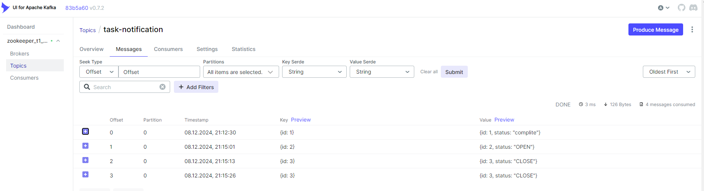
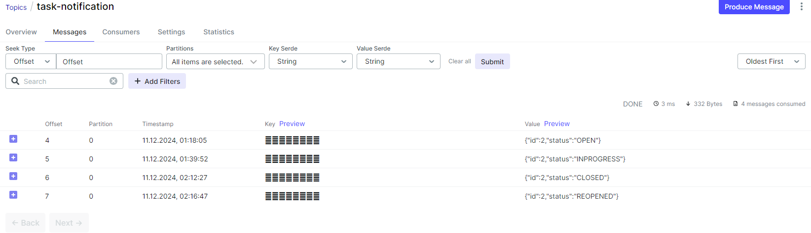
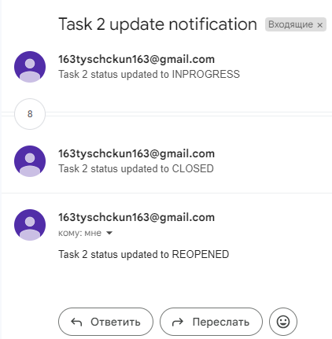

# t1-school

### Task 1. CRUD приложение + логи через аспекты

Создать простой RESTful сервис для управления задачами:

Task(id, title, description,userId)

* POST /tasks — создание новой задачи.
* GET /tasks/{id} — получение задачи по ID.
* PUT /tasks/{id} — обновление задачи.
* DELETE /tasks/{id} — удаление задачи.
* GET /tasks — получение списка всех задач.
---
Реализуйте класс аспект, со следующими advice:
* Before
* AfterThrowing
* AfterReturning
* Around

В приложении должна быть реализована логика на каждый advice - свой метод, можно сделать больше, использовать несколько advice на отдельные методы, но меньше нельзя.

### Task 2. Kafka

1. Использовать docker-compose для установки Kafka в Docker (пример демонстрируется на уроке)

1.1 Установить необходимые инструменты для работы с Kafka. Big Data Tools, Offset Explorer и др. на свое усмотрение и возможности, результатом должна быть возможность "заглянуть" в кафку

2. Создать тестовый topic, установленными средствами

3. Отправить в топик тестовые сообщения Notification

4. Убедиться в их наличии

5. Сконфигурировать Kafka, Producer, Consumer в вашем сервисе работы с Task.

6. Продюсер пишет в топик id и новый статус task у которых он изменился, при соответствующем входящем запросе (обновления task).

7. Консьюмер слушает этот топик, читает оттуда сообщения, и отправляет в NotificationService (условно сервис заглушка, для имитации отправки уведомления, можно просто логировать)

8. Дополнительно: использовать spring-boot-starter-mail, и в NotificationService реализовать отправку email

### Task 4. Разработка тестов для сервиса управления задачами

Покрыть свой RESTful сервис для управления задачами тестами.

1. Напишите модульные тесты для каждого метода сервиса или маппера(ов).

    • Используйте JUnit и Mockito для создания тестов.

    • Убедитесь, что методы корректно (или некорректно) отрабатывают и обрабатывают исключения (например, задача не найдена).

2. Напишите интеграционные тесты для вашего сервиса.

    • Используйте Spring Boot Test и MockMvc для создания интеграционных тестов.

    • Учитывайте взаимодействие вашего сервиса с внешними системами (например с БД, используйте тест контейнер)

    • Убедитесь, что все эндпоинты возвращают(или нет) ожидаемые результаты.